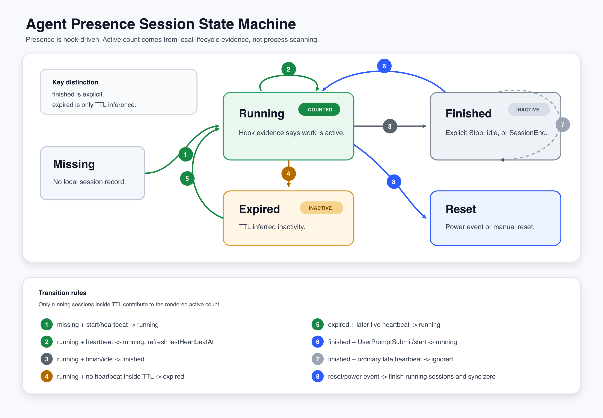

# Agent Presence Architecture

`@rivus/agent-presence` turns local coding-agent lifecycle events into a Feishu signature link-preview value. The important boundary is that it models active work from agent hooks, not from process scans.

```text
Codex / Claude Code / Gemini CLI / opencode / Pi Coding Agent lifecycle hooks
-> CLI hook normalizer
-> locked JSON state
-> TTL pruning
-> debounce renderer
-> slot provider update
-> Feishu signature link preview
```

Two paths share this pipeline:

```text
interactive path: login / setup / config / status / url / update / reset
hook path:        agent lifecycle event -> silent CLI -> local state -> optional slot sync
deferred path:    scheduled internal flush -> render cached state -> slot sync
```

The interactive path can use prompts and rich output. The hook path must be fast, bounded, non-interactive, and safe to call from another agent runtime.

## Goals

- Count agents that are actively working.
- Keep Feishu profile writes out of the hot path by updating a reusable slot.
- Store credentials only in Keychain, libsecret, or environment variables.
- Make hooks safe to run inside coding-agent lifecycles.
- Recover from abnormal exits with TTL and power-event reset hooks.
- Support the macOS local-agent environment first, with Linux as a supported platform.
- Let `npx @rivus/agent-presence setup` be the easy install entrypoint without making installed hooks depend on an ephemeral `npx` cache.
- Make setup and uninstall repeatable: rerunning either command should not duplicate hooks, lose user configuration, or leave half-written managed files.

## Non-Goals

- Process scanning or terminal-window detection.
- A generic status dashboard.
- Server-side session tracking.
- Windows runtime support.
- Full provider abstraction beyond the first Feishu signature slot provider.

## Runtime Components

### Local Directories

`src/config.ts` owns the local home directory. By default it is:

```text
~/.agent-presence
```

The home directory contains local state, config, and logs. It is intentionally outside the package install directory so `npx`, global installs, local checkouts, and future managed runtimes all share the same durable state.

```text
~/.agent-presence/
  state.json               local JSON state
  config.json              provider/render configuration
  agent-presence.log       hook and command diagnostics
  runtime/                 managed hook runtime, when setup materializes one
  bin/                     stable hook shims, when setup materializes them
```

Credentials are not stored in this directory. They live in Keychain (macOS), libsecret (Linux), or environment variables.

When setup finds a legacy `~/.codex/agent-signature` directory, it asks before copying known local files that are still missing from `~/.agent-presence`. Existing destination files are never overwritten. Once a known legacy file exists in the new home, setup removes the old copy from `~/.codex/agent-signature`; unknown files are left untouched. The legacy `~/.codex/agent-signature/config.json` path is still read when the new config file does not exist, so a skipped migration does not break first-run setup. New writes and logs use `~/.agent-presence` unless `AGENT_PRESENCE_HOME`, `AGENT_SIGNATURE_HOME`, or file-specific environment variables override the paths.

### CLI

`src/cli.ts` is the public entrypoint. It delegates immediately to `src/cli/app.ts`, which routes to one command module per command.

The CLI allows help output everywhere, then rejects unsupported runtime platforms through `src/platform.ts`. The direct installer scripts use the same guard.

Human-facing commands use `@clack/prompts` for interaction:

```text
login   -> intro, QR note, authorization spinner, outro
setup   -> intro, installer spinner, signature URL note, outro
config  -> text prompts when provider/render values are omitted in a TTY
```

Machine-facing commands stay plain:

```text
status/update/reset -> JSON or silent output
flush               -> internal cache-only deferred publisher
hook                -> pass-through `{}` for Codex or silent output for other agents
url                 -> raw URL only
```

This keeps the pretty CLI layer out of hook and automation protocols.

The CLI files are split by responsibility:

```text
src/cli/app.ts              command routing
src/cli/args.ts             argv parsing helpers
src/cli/ui.ts               Clack wrapper and non-TTY fallback
src/cli/slot-sync.ts        state-lock to provider-sync bridge
src/cli/hook-context.ts     built-in source hook context selection
src/sources.ts              source registry: built-ins plus configured plugin sources
src/cli/commands/*.ts       one command or subcommand per file
src/json-file.ts            shared JSON read and atomic write helpers
src/hooks/context.ts        shared hook payload/env string extraction
```

The package exposes both binaries:

```text
agent-presence   primary CLI
agent-signature  compatibility alias for older hooks
```

### Managed Hook Runtime

`npx` is a convenient installer but a poor hook target. Some agent runtimes launch hooks with a minimal `PATH`, and `npx` may resolve through a temporary cache that can move or be pruned. The setup architecture therefore treats `npx` as a bootstrapper, not as the durable runtime.

The target shape is:

```text
npx @rivus/agent-presence@<version> setup
-> install or update a managed runtime under ~/.agent-presence/runtime
-> write stable shims under ~/.agent-presence/bin
-> install Codex / Claude Code / Gemini CLI / opencode hooks that call those shims by absolute path
-> prompt the user to approve updated Codex hooks when Codex requires trust
```

The hook command should point to a stable file owned by Agent Presence, for example:

```text
/Users/<user>/.agent-presence/bin/agent-presence-hook --source codex --event SessionStart
```

It should not point to:

```text
npx @rivus/agent-presence@latest ...
<npm-cache>/_npx/.../node_modules/@rivus/agent-presence/...
```

Versioned setup can still preserve reproducibility by materializing the exact package version that invoked setup. Future setup runs replace the managed runtime atomically and then rewrite hooks to the new stable shim.

### Configuration

`src/config.ts` owns durable local configuration. Provider-specific options stay under the provider id, so the generic presence model does not need Feishu-specific names.

The current provider id is:

```text
feishu-signature
```

The provider can be configured with a base URL, preview base URL, image key, and target URL. Token and slot id are credentials, so they are resolved through `src/secret.ts` instead of being embedded in the URL.

### State Store

`src/state.ts` stores the local state as JSON under the user state directory. Updates are guarded by a local lock file so concurrent hooks do not clobber each other.

State has two layers:

```json
{
  "sessions": {
    "thread_id": {
      "id": "thread_id",
      "source": "codex",
      "kind": "coding",
      "status": "running",
      "startedAt": 1778576582452,
      "lastHeartbeatAt": 1778576891386
    }
  },
  "lastSlotUpdateAt": 1778577015486,
  "lastValue": "1 个 AI 牛马正在搬砖 | codex 1"
}
```

`sessions` is the event-derived truth. `lastSlotUpdateAt` and `lastValue` are the renderer/provider debounce checkpoint.

### Hook Normalization

The hook adapters in `src/hooks/` map each agent's lifecycle vocabulary to the shared session state:

```text
start event      -> running
heartbeat event  -> running with fresh lastHeartbeatAt
finish event     -> finished
idle event       -> finished
```

Current source mapping:

```text
Codex       SessionStart, UserPromptSubmit, PreToolUse, Stop
Claude Code SessionStart, UserPromptSubmit, PreToolUse, PostToolUse, Stop, StopFailure, SessionEnd, SubagentStart, SubagentStop
Gemini CLI  SessionStart, UserPromptSubmit, PreToolUse, PostToolUse, Stop, SessionEnd
opencode    session.created, command.executed, file.edited, message.*, permission.*, session.*, todo.updated, tool.execute.*
Pi          before_agent_start, turn_start, tool_execution_start, tool_execution_end, agent_end, session_shutdown
```

Codex hooks always print `{}` so they remain valid pass-through hooks. Claude Code, Gemini CLI, opencode, and Pi hooks run with `--silent`.

The five sources above are built in. They live in a source table that a user's config can extend, override, or disable without a core change; see [Source Table](#source-table).

For Pi specifically, the extension intentionally does **not** treat the Pi `session_start` event as an active-session signal — that event fires whenever the Pi TUI opens, including when the user has not yet submitted a task. Activation is gated on `before_agent_start`, which only fires after the user submits a prompt. Heartbeats come from `turn_start` and `tool_execution_*`. Finishes come from `agent_end` (turn done) and `session_shutdown` (Pi quit, reload, or session switch).

Hook commands are managed entries. Installers identify them by the `agent-presence hook` or legacy `agent-signature hook` command shape, remove the old managed entries, and then add the current managed entry. This keeps reruns from accumulating duplicate hooks.

### Session State Machine



The editable SVG source for this diagram lives at [`assets/presence-state-machine.svg`](assets/presence-state-machine.svg).

Each session record has one of three statuses:

```text
running   explicit local evidence says this agent session is working
finished  an explicit finish/idle event ended the current work turn
expired   TTL inferred inactivity because no heartbeat arrived in time
```

`finished` and `expired` are intentionally different. `finished` comes from an explicit lifecycle event and protects the state from late async hook traffic after a turn has stopped. `expired` is only an inactivity inference, so a later live heartbeat from the same session can reopen it.

The shared transition rules are:

```text
missing session + start/heartbeat       -> running
running + heartbeat                     -> running, refresh lastHeartbeatAt
running + finish/idle                   -> finished
running + no heartbeat inside TTL       -> expired
expired + start/heartbeat               -> running, refresh startedAt and lastHeartbeatAt
finished + ordinary late heartbeat      -> finished, ignored
finished + UserPromptSubmit/start       -> running, new active turn for same agent session
unknown finish id + matching source/project running session
                                         -> finish latest matching running session
reset / power event                      -> finish all running sessions, preserve cached usage, and sync zero
```

This gives the model two recovery paths without process scanning:

- Missed finish hooks are cleaned up by TTL expiry.
- Long-running sessions that keep working after a TTL expiry can become active again on the next real heartbeat.

### Active Semantics

Active means "currently doing agent work", not "the terminal is open".

```text
running session with heartbeat inside TTL -> active
finished session                         -> inactive
no heartbeat for TTL                     -> expired and inactive
expired session with later heartbeat     -> running again
sleep / lid close / logout / shutdown    -> reset to 0
wake                                     -> reset to 0 again
```

The default TTL is 3 minutes. This handles abnormal exits, hard kills, and missed finish hooks without scanning local processes. An expired session is not a terminal state; it is inactive until a later real heartbeat proves that the same agent session is working again.

### Rendering

`src/render.ts` groups active sessions by source and formats the slot value:

```text
0 -> AI 牛马暂未开工
1 -> 1 个 AI 牛马正在搬砖 | codex 1
N -> N 个 AI 牛马正在搬砖 | codex W · claude X · gemini Y · opencode Z
```

Templates are configurable through `agent-presence config render` and environment variables. Rendered values are capped at 200 characters before provider update.

### Debounce And Provider Updates

Slot writes are rate-limited because the slot provider should not be hammered by hook traffic. Hooks update local state immediately, then the renderer compares the newly rendered value with `lastValue` and `lastSlotUpdateAt`.

Normal updates obey the debounce interval. `update --force` and `reset --force` bypass the local debounce when the user or power watcher explicitly asks for a sync.

A debounced or rate-limited write schedules the internal `flush --force --silent` command. `flush` renders the already-persisted presence and usage cache; it never collects transcripts. This keeps retrying provider delivery separate from the explicit `update` command, whose application semantics include a complete usage refresh.

Network I/O is kept outside the state mutation lock. That keeps hook contention small and prevents a slow provider request from blocking unrelated lifecycle writes.

### Provider Registry

`src/providers/types.ts` defines a capability-oriented `PresenceProvider` interface, and `src/providers/registry.ts` exposes `createProvider(id, { config, credential })`. CLI commands resolve a provider through the registry and call `assertSupports*` for the capability they need (login, publish, signature url) instead of importing a storage backend directly. This is the seam new providers plug into.

Capabilities are optional because not every provider supports every operation:

- `createQrCode` / `getLoginStatus` — login.
- `publishValue(value)` — push the rendered value to wherever the provider stores it.
- `getInfo()` — raw backend read for `status --remote`.
- `buildSignatureUrl()` — the link-preview URL the signature embeds.
- `getRemotePreview()` — a front-end provider's own server-rendered preview (magic-builder's FaaS output).

#### Slot backend vs. provider

The two shipped providers are not independent backends: they read and write the **same** slot. That shared storage is modelled explicitly as a `SlotBackend` (`src/providers/slot-backend.ts`), implemented by `LGaryYangSlotBackend`. Both `feishu-signature` and `magic-builder` *compose* the same `SlotBackend` for login/publish/info and differ only in the signature URL (and, for magic-builder, the `getRemotePreview` FaaS read). Neither provider depends on the other.

The capability layer is deliberately generic (`publishValue`, not `updateSlot`) so a future provider with its own, slot-unrelated storage can implement `PresenceProvider` directly and never touch `SlotBackend`. Its own credential model and login flow would be added alongside at that point; the registry seam itself does not change.

### Source Table

Sources (which agents feed presence) are modelled as a single **source table**, so first-party and third-party agents are handled uniformly. `src/cli/hook-context.ts` defines one `SourcePlugin` interface (`{ id, resolveHookContext(payload, env) }`) and keeps the five built-in resolvers (`codex`, `claude`, `gemini`, `opencode`, `pi`) as its reference implementations in `BUILTIN_SOURCE_PLUGINS`. `src/sources.default.json` ships a default table that lists those built-ins as `builtin:<id>` handlers.

`src/sources.ts` computes the **effective table** by merging the user's `config.plugins.sources` over the shipped defaults by id (`mergedSources`): a same-id entry **overrides** a built-in, a new id **adds** a source, and `enabled: false` **disables** one. `resolveHookContextForSource(source, payload, config)` then resolves an id from that table. Not writing a `plugins.sources` (or a given id) leaves the shipped default in effect. Downstream of context resolution the pipeline is already source-agnostic — `AgentSession.source` is a plain string, `renderDetails` groups by it verbatim, and `normalizeEvent` understands the PascalCase lifecycle events — so a source only needs to turn its hook payload into `{ sessionId, project, event }`.

A table entry resolves by kind:

- **`builtin:<id>`** — reuse the shipped in-code resolver. **Trusted** (first-party, ships with the package): receives the raw environment, since built-ins rely on env fallbacks.
- **Declarative `match`** — no code. Each of `sessionId` / `project` / `event` is a `pickString`-shaped field spec (`envKeys` / `payloadKeys` / `nestedPayloadKeys` / `payloadFirst`), so it reaches nested payloads and controls env-vs-payload precedence like a built-in.
- **JS `handler`** — an absolute path or npm specifier for an ESM module whose `default` export is a `SourcePlugin`. agent-presence `import()`s it in-process during a hook.

Trust follows the `builtin:` marker, not the id: a user who overrides `codex` with their own `handler` gets the guarded path. Because a `handler` runs in-process with full CLI trust (including credential access), loading is guarded: it is opt-in (shipped defaults are all `builtin:` and run no user code), the handler receives a **curated env** with credential-bearing keys stripped, an absolute-path handler is refused if it is a symlink / not owned by the current user / world-writable, and `handler` entries are ignored entirely if `config.json` itself is world-writable or not user-owned. Handler failures fail open — logged with non-secret fields only, degrading to an empty context — so a source can never break a hook. `agent-presence config show` prints the merged table as `sources`, each with its `origin` (`default`/`config`), `kind` (`builtin`/`handler`/`match`), and `overridesDefault` flag. Full design: [`rfcs/source-plugins.md`](../rfcs/source-plugins.md).

#### Installing a source by package

`agent-presence source add <npm-package>` downloads a source-plugin package and registers it, so operators do not hand-edit config. It `npm install`s (via `execFile`, with `--ignore-scripts`) into an isolated plugins dir (`~/.agent-presence/plugins/`, override `AGENT_PRESENCE_PLUGINS_DIR`) so packages land under `<pluginsDir>/node_modules`, never in the CLI's own install; use `--registry` (or `AGENT_PRESENCE_REGISTRY`) for an internal registry. It then validates the package exports a real `SourcePlugin`, and records `plugins.sources.<id> = { handler: "<packageName>" }` — the merged table stays the one source of truth. At hook time a bare specifier resolves from the plugins dir via `createRequire`. `source list` prints the merged table; `source remove <id>` unregisters and (unless `--keep-package`) uninstalls the package; `uninstall --all` removes the whole plugins dir. Because `add` downloads and runs third-party code in the credential-bearing process, it prints a trust notice and requires `--yes` or an interactive confirmation.

#### Token usage (`scanUsage`)

Token/cost accounting is a **capability of the same source table**, not a separate subsystem: `SourcePlugin` carries an optional `scanUsage(window)` method, so a source is one thing that declares all its capabilities. A source that implements `scanUsage` is billable; one that omits it (any `match` source) contributes presence only. All five built-ins are billable — each pairs its presence resolver with a transcript scanner (`src/usage/scan-*.ts`) registered on its `BUILTIN_SOURCE_PLUGINS` entry — and a JS `handler` source can implement `scanUsage` too.

`billableSources(config)` (`src/sources.ts`) enumerates the merged table's billable sources, in table order, through the **same** trust/resolution path as presence (`builtin:` → trusted shipped plugin; JS `handler` → the guarded, cached loader; `match` → skipped). `collectWindowUsage()` iterates that list — no hardcoded source set — so `agent-presence usage` and the signature badge both cover every billable source dynamically. Usage stays **after-the-fact transcript scanning** (ccusage-style), independent of the hook payload; hook events never carry token counts.

Signature accounting keeps a per-window, per-source snapshot in state. A session-boundary hook refreshes only the contribution owned by its source (`opencode` scans opencode, `codex` scans Codex, and so on), then the renderer aggregates the configured source snapshots. This prevents one agent's lifecycle event or scanner version from recalculating another agent's ledger. An explicit `agent-presence update` is the only signature path that scans and replaces the complete built-in snapshot set; deferred flushes and power-event resets only re-render the cache. During migration from the older aggregate-only cache, or after midnight when only some sources have refreshed into the new calendar-day window, a partial source refresh preserves the previous badge and timestamp until every configured source has a compatible current-day snapshot; it never presents a partial or cross-day value as the total.

Two trust/portability details:

- **Hot path stays first-party and source-scoped.** The signature-badge refresh calls `billableSources(config, { includeHandlers: false })`, then a hook selects only its own built-in source — it never scans another source and never `import()`s a third-party `handler` to probe for `scanUsage`. An explicit update scans all built-ins. The standalone `usage` command is interactive and includes handlers.
- **`node:sqlite` is guarded.** The opencode scanner prefers opencode's SQLite store (`~/.local/share/opencode/opencode.db`) and imports `node:sqlite` **dynamically inside the function** (with a legacy-JSON fallback), because that builtin does not exist before Node 22 while `engines.node` allows `>=20`. A static import would break the hook on older Node.

Cost semantics live in `src/usage/pricing.ts`: Pi and opencode log a real per-message cost, which is trusted as-is (even `0`); Claude, Codex, Gemini, and TraeX-style handlers reprice by model id. Claude records one-hour cache creation separately from its default five-minute cache, so the scanner preserves that subset and pricing applies LiteLLM's dedicated one-hour rate. Codex pricing follows ccusage's `--speed auto` behavior: the scanner reads the current `service_tier` from `~/.codex/config.toml` and applies the priority multiplier to the report. The primary price table is a committed **LiteLLM snapshot** (`src/usage/litellm-pricing.json`) generated by `pnpm run update-pricing`, filtered to the model ids agent-presence sources actually record (for example `gpt-5.6-sol`, `claude-sonnet-5`, `deepseek-v4-pro`, `gemini-3-flash-preview`) rather than the full LiteLLM database. A weekly GitHub Action regenerates the snapshot and opens a PR when those supported-model prices drift. Resolution order is user `config.usage.pricing` overrides, then the LiteLLM snapshot, then the small fallback `DEFAULT_PRICING` table. Unknown models still show `n/a` while token counts stay exact. Full design: [`rfcs/source-usage.md`](../rfcs/source-usage.md).

### Provider

`src/providers/l-garyyang.ts` implements the first slot backend:

```http
GET  /api/slot/wechat/qrcode
GET  /api/slot/wechat/login-status?sceneId=...
POST /api/slot/update
GET  /api/slot/info
```

The Feishu signature stores a link like:

```text
https://l.garyyang.work/?t2=<base62({{slot id="slot_xxx"}})>
```

The URL references the slot helper only. It must not contain tokens, local state, or machine-specific paths.

### Magic-Builder Provider

`src/providers/magic-builder.ts` is a second provider id, `magic-builder`. It does not replace `feishu-signature`; it is an alternate **front-end for the signature URL** that keeps the same l.garyyang slot as the value store.

**Why it exists.** The `feishu-signature` URL is an `l.garyyang.work` HTML page that renders inside Feishu's personal-signature link preview via an iframe. When Feishu tightens what that preview surface will render (e.g. an iframe-host whitelist change), the `l.garyyang.work` URL can stop displaying even though the slot value is still correct. `magic-builder` re-fronts the same value through `magic.solutionsuite.cn`, whose link-preview pipeline Feishu accepts, without changing how presence is computed or written.

**How it works.**

```text
hooks -> l.garyyang slot (unchanged write path)
                 ^
                 | GET /api/slot/info  (fetched on each preview refresh)
magic-builder FaaS  (published once to magic.solutionsuite.cn/api/faas)
                 ^
                 | Feishu pulls the link preview
signature URL = https://magic.solutionsuite.cn/r?fid=<record_id>
```

Setup renders a small CommonJS link-preview FaaS (`buildFaasCode`), `POST`s it to `magic.solutionsuite.cn/api/faas`, and persists the returned `record_id` under `providers.magic-builder.faasId` in `config.json`. Re-running setup `POST`s with the same `id` to update the function in place (idempotent). The FaaS returns the Feishu `url.preview.get` shape:

```json
{ "inline": { "i18n_title": { "zh_cn": "<current slot value>" } }, "expire_strategy": "60s" }
```

`expire_strategy` is the finest magic-builder cache granularity (60s). Combined with the writer-side debounce and Feishu's own client-side preview cache, the user-visible refresh is minute-scale, not real-time — adequate for an "agents currently working" indicator.

**Token acquisition (onboarding).** Publishing to `/api/faas` requires a magic-builder token, which is tied to the user's Feishu identity (the service authenticates through Feishu SSO). The CLI cannot bootstrap it headlessly. Resolution order is `MAGIC_TOKEN` env → OS keyring (`agent-presence:magic-builder`) → `~/.magic-token` → `<cwd>/.magic-token`. In an interactive terminal with no token, setup prints the acquisition steps (open the 妙笔 Feishu bot, send `dev`, copy the reply) and prompts for the token, then stores it in the keyring via the generic secret store. The plaintext `~/.magic-token` file is read for skill-pack compatibility but is never written by this CLI. The token prompt is gated behind the l.garyyang credential check: magic-builder needs an existing slot to read from, so a user must `login --provider feishu-signature` before the token prompt appears.

**Trust-boundary trade-off.** The published FaaS embeds the user's l.garyyang slot bearer so it can call `GET /api/slot/info` on each preview refresh. This sends a credential across the trust boundary to `magic.solutionsuite.cn`, which is why publishing requires explicit operator action rather than running unattended. It is accepted because the FaaS is private to the publisher's own magic-builder account and the slot bearer is low-sensitivity (read/write of one presence slot, no account access). Rotating that bearer requires re-running `setup --provider magic-builder` to re-publish. A future iteration could remove the embedded bearer by having l.garyyang expose an unauthenticated read-only slot endpoint, or by moving the value store to a Feishu bitable the FaaS reads with its own injected token.

### Linux Credential Storage

On Linux, the priority order for credential resolution is:

1. **Environment variables** — same cross-platform env vars as macOS (`AGENT_PRESENCE_TOKEN`, `AGENT_PRESENCE_SLOT_ID`, etc.).
2. **libsecret** (`secret-tool` CLI) — stores credentials in the system keyring (e.g., GNOME Keyring, KDE Wallet). Uses `service=agent-presence`, `account=token` and `account=slotId` attributes.
3. **Reject** — if neither env vars nor `secret-tool` is available, the CLI bails with a clear error instructing the user to install `gnome-keyring` or `libsecret-tools`.

Credentials are never written to `config.json`.

### Linux Power Watcher

On Linux, agent-presence skips the power watcher. Systemd user services and logind D-Bus signals are not reliably available across distributions for the suspend/resume/lock/unlock lifecycle that the macOS LaunchAgent covers.

The setup command outputs:

```
agent-presence: skipping power watcher on linux
  (no reliable systemd/logind path); TTL pruning still covers expired sessions.
```

TTL pruning (3-minute default) handles most failure modes (agent crashes, hard kills, terminal closures). A future Linux watcher is documented in `rfcs/linux-watcher.md`.

### Setup And Idempotency

`src/setup.ts` and `src/installers.ts` coordinate first-run setup:

- login when no provider credential exists, unless `--skip-login` is passed
- reuse existing provider credentials without prompting again
- write provider preview configuration
- install Codex hooks
- install Claude Code hooks
- install the opencode plugin
- install Gemini CLI hooks
- install the Pi Coding Agent extension at `~/.pi/agent/extensions/agent-presence.ts`
- install the macOS power watcher (skipped on Linux; TTL pruning handles expired sessions)
- force an initial slot sync

Each installer is idempotent. Existing unrelated user configuration is preserved.

Idempotency is part of the installer contract, not a nice-to-have:

| Area | Idempotency rule |
| --- | --- |
| Provider login | Reuse existing Keychain credential and configured slot. Normal setup starts QR login only when credentials are missing; `--skip-login` refreshes hooks without login checks, and `--login` forces fresh authentication. |
| Config | Merge provider/render settings without deleting unrelated keys. |
| Codex hooks | Remove prior managed Agent Presence hooks, add exactly one current managed group per event, then remind the user to approve changed hooks in Codex settings. |
| Claude Code hooks | Remove prior managed Agent Presence hooks, add exactly one current managed group per event. |
| opencode plugin | Rewrite the managed plugin file from the current package; do not append duplicate plugin registrations. |
| Pi extension | Rewrite the managed `~/.pi/agent/extensions/agent-presence.ts` from the current package; refuse to overwrite a non-managed file with the same name. Pi auto-discovers the file, so settings.json is not modified by default. Uninstall removes only the managed file and only its own entry from `settings.json#/extensions`. |
| Power watcher | On macOS: replace the managed LaunchAgent plist and script, then reload the same label. On Linux: skipped with a message; TTL pruning covers expired sessions. |
| Managed runtime | Install into a staging directory first, then atomically switch the active runtime or shim target. |
| Legacy home migration | During interactive setup, ask before copying known files from `~/.codex/agent-signature` to `~/.agent-presence`; never overwrite existing destination files; remove known legacy files after the new home has them; keep unknown files. |
| State | Preserve local session state during setup; only `reset` or `uninstall --all` clears it. |
| Credentials | Preserve credentials during normal setup and uninstall; only `uninstall --credentials` or `uninstall --all` removes them. |

This makes the supported repair command simple:

```bash
npx --yes --registry=https://registry.npmjs.org @rivus/agent-presence@<version> setup --provider feishu-signature
```

Users should be able to run that command repeatedly after package upgrades, hook corruption, path changes, or partial installs.

### Codex Hook Trust

Codex Desktop stores a trust hash for each hook entry. Rewriting `~/.codex/hooks.json` changes those hashes, so a hook can be present but not executed until the trust state is updated.

Setup should:

1. Write the managed Codex hooks.
2. Print a clear reminder that Codex may require approval before updated hooks run.
3. Leave `~/.codex/config.toml` trust state untouched.

This keeps Agent Presence from silently changing Codex's trust database. The cost is one manual approval step when Codex marks hooks as new or modified.

If Codex later exposes an official trust API or CLI command, setup can call that supported interface for the managed Agent Presence hooks only. Until then, the CLI should prompt instead of editing TOML trust hashes directly.

### Uninstall

`uninstall` removes managed integration points while preserving user-owned data by default:

```text
agent-presence uninstall
-> remove managed Codex hooks
-> remove managed Claude Code hooks
-> remove managed Gemini CLI hooks
-> remove managed opencode plugin
-> remove managed Pi Coding Agent extension
-> unload and remove managed power watcher
-> keep Keychain credentials, provider config, and state
```

Credential and data removal are explicit:

```text
agent-presence uninstall --credentials  removes credentials and slot config
agent-presence uninstall --all          removes hooks, credentials, config, state, and managed runtime
```

Uninstall is also idempotent. Running it on a machine with no installed hooks should be a clean success.

## Observability

The project needs enough local observability to answer three questions quickly:

```text
Did the agent hook run?
Did local state change?
Did the provider request happen, skip, rate-limit, or fail?
```

### Local Command Log

`src/log.ts` writes a local append-only diagnostic log. The default path is:

```text
~/.agent-presence/agent-presence.log
```

It can be overridden with:

```text
AGENT_PRESENCE_LOG_FILE
AGENT_SIGNATURE_LOG_FILE
```

Current hook commands log notable failures such as missing session ids or hook exceptions. Timestamps are formatted in China time with an explicit `+08:00` offset so local traces are readable without mental UTC conversion. The log must not contain provider tokens, full Authorization headers, QR code tickets, or local prompt payloads.

### Power Watcher Log

The LaunchAgent redirects stdout and stderr to:

```text
~/.agent-presence/power-watch.log
```

This log is for watcher startup/runtime failures. It should stay credential-free because the watcher only invokes `agent-presence reset --force --silent`.

### Provider Request Log

Provider request logging is structured, single-line, and redacted. The intent is to debug slot sync behavior without leaking credentials or noisy hook payloads. Successful login QR and login polling requests are intentionally not logged by default because login polls every few seconds; failures, rate limits, slot updates, and slot info reads are logged.

Successful slot update event shape:

```text
time=2026-05-15T18:00:00.000+08:00 level=info app=agent-presence pid=12345 type=provider.request provider=feishu-signature method=POST path=/api/slot/update status=200 durationMs=123 slotId=slot_xxx... valueLength=31 result=updated
```

For failures:

```text
time=2026-05-15T18:00:00.000+08:00 level=info app=agent-presence pid=12345 type=provider.request provider=feishu-signature method=POST path=/api/slot/update status=429 durationMs=80 slotId=slot_xxx... retryAfterMs=60000 result=rate-limited
```

Logging rules:

- Log request method, normalized path, status, duration, result, retry-after, slot id prefix, and value length.
- Do not log bearer tokens, raw Authorization headers, QR code tickets, full login URLs, raw provider response bodies, or full slot values by default.
- Treat 429 as a successful local outcome with `result: "rate-limited"` because local state remains correct and the next eligible sync can recover.
- Keep provider network I/O outside the state lock; logging must not extend lock hold time.

### Status Readback

`status --provider feishu-signature` reads local state and rendered value. `status --provider feishu-signature --remote` additionally reads the remote slot. Together they are the primary readback tools for debugging mismatches:

```text
local activeCount/value differs from remote value -> debounce, 429, network, or provider write failure
local value is wrong                            -> hook/session/state normalization bug
remote value is wrong but local is correct      -> provider sync path bug or delayed write
```

## Failure Model

| Failure | Expected behavior |
| --- | --- |
| Agent exits without a finish hook | Session expires after TTL. |
| Hook command fails | Coding agent continues; Codex receives `{}`. |
| Provider returns 429 | Local state remains correct; next non-debounced update can sync. |
| Laptop sleeps or lid closes | On macOS, power watcher resets local and remote state to 0 when possible. On Linux, TTL pruning clears sessions after expiry. |
| Sudden power loss | Wake reset (macOS) and TTL clear stale sessions. |
| Keychain is unavailable | Explicit environment variables can supply token and slot id. |
| Linux has no secret-tool | Credential operations bail with a clear install instruction; env vars still work. |
| `npx` cache disappears after setup | Managed hooks keep working because they target the stable runtime or shim. |
| Setup is interrupted halfway | The previous runtime/config remains usable; the next setup run can repair managed files. |
| Codex hooks are present but not trusted | Setup prints a reminder; approve the managed hooks in Codex settings. |

## Security Boundaries

- Credentials live in Keychain (macOS), libsecret (Linux), or environment variables.
- Credentials are not written to git, the signature URL, logs, hook files, or local config files.
- On Linux, if neither environment variables nor libsecret (secret-tool) is available, credential operations fail with a clear error instead of falling back to plaintext storage.
- Hooks use lifecycle events instead of process scanning.
- The provider writes only slot value changes, not Feishu profile fields.
- Codex hooks are pass-through and bounded by agent hook timeouts.
- Setup modifies only known hook/plugin/watcher locations and preserves unrelated user entries.
- Logs are local diagnostics. They must be redacted by construction and should remain useful even when shared in a bug report.
- The credential guarantees above ("not written to logs / never leaves the machine") describe the **built-in / default** code paths. A user-configured source `handler` (see [Source Table](#source-table)) runs in-process with full CLI trust, which includes the ability to read the slot credential; agent-presence reduces the default exposure (curated env, path/config ownership checks, opt-in loading, redaction-safe fail-open logging) but does not sandbox the handler, so a `handler` is code the operator is responsible for vetting. The no-code `match` tier and `builtin:` entries run no user-supplied code and carry none of this risk.
- The `magic-builder` provider is the one deliberate exception to "credentials never leave the machine": its published FaaS embeds the l.garyyang slot bearer so it can read the slot on `magic.solutionsuite.cn`. This is gated behind explicit operator action and documented under [Magic-Builder Provider](#magic-builder-provider); the embedded value is the low-sensitivity slot bearer only, never the magic-builder token (which stays in the OS keyring).

## Package And Release Safety

The repository is managed with pnpm and pins the package manager through `packageManager`.

Supply-chain settings live in `pnpm-workspace.yaml`:

```text
minimumReleaseAge: wait before accepting newly published packages
minimumReleaseAgeStrict: fail instead of falling back to too-new versions
minimumReleaseAgeIgnoreMissingTime: require registry publish-time metadata
blockExoticSubdeps: block transitive git or tarball URL dependencies
strictDepBuilds: fail on unreviewed dependency build scripts
pmOnFail: require the declared pnpm version
engineStrict: enforce Node engine compatibility
verifyDepsBeforeRun: do not auto-install before scripts
```

CI installs with a frozen pnpm lockfile and `--ignore-scripts`. Release uses Changesets plus npm Trusted Publishing, so the GitHub workflow gets an OIDC token and does not need an npm token secret.

## Extension Points

New agent sources ship best as a built-in hook adapter that emits the shared lifecycle actions, registered in the shipped [Source Table](#source-table). A source that cannot live in core — an internal agent, or one that must be onboarded without a public release — is added through a `plugins.sources` config entry (declarative `match` or a JS `handler`) that merges over the default table; the same mechanism lets an operator override or disable a built-in. New providers should implement the same slot-style contract first, so profile-specific or network-specific write logic stays behind provider boundaries. A provider may also be a pure **front-end** that reuses an existing slot store and only changes how the signature URL is published, as `magic-builder` does over `feishu-signature`.
